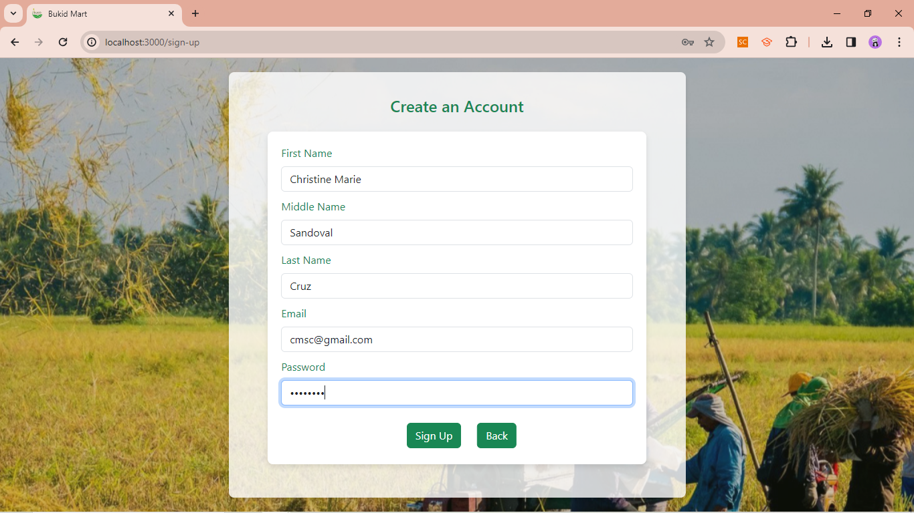
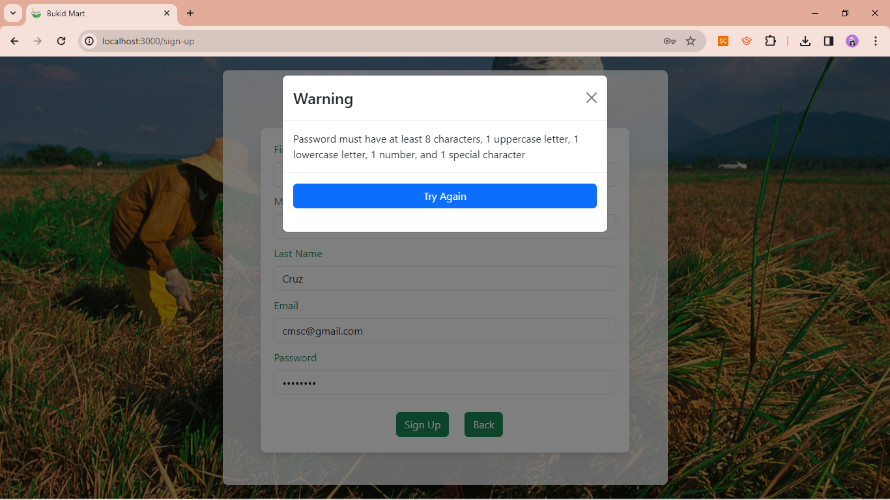
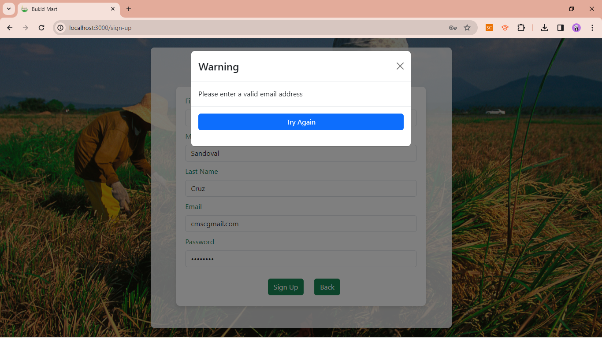
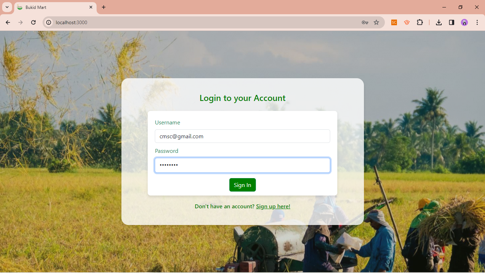
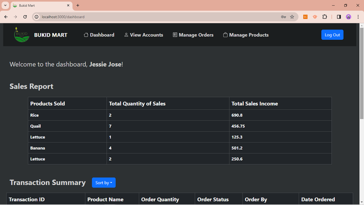
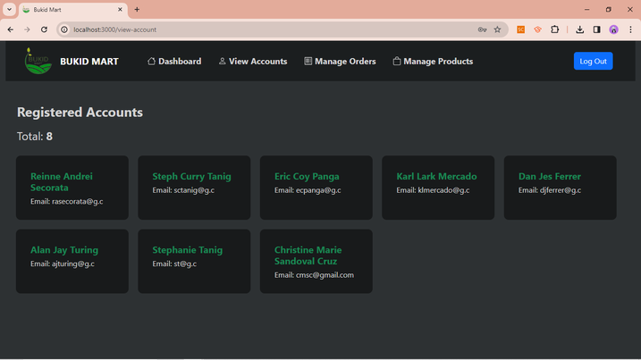
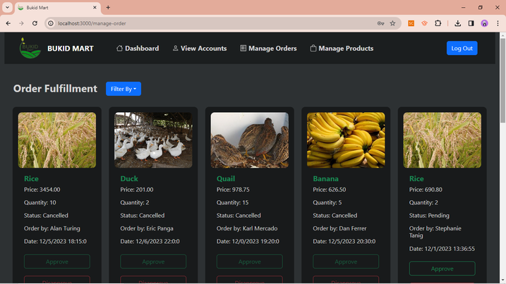
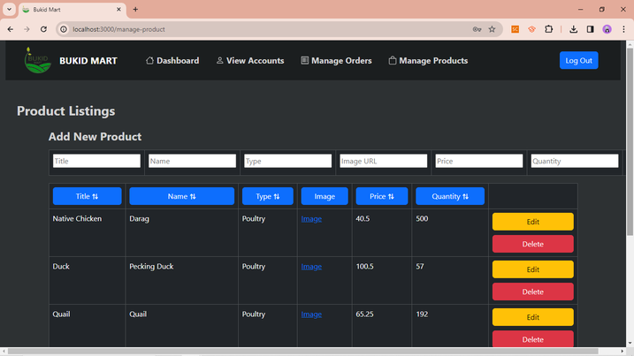
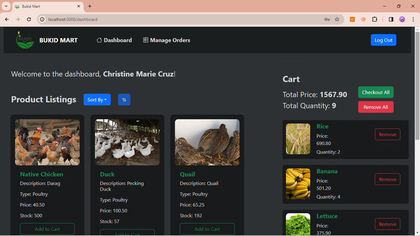
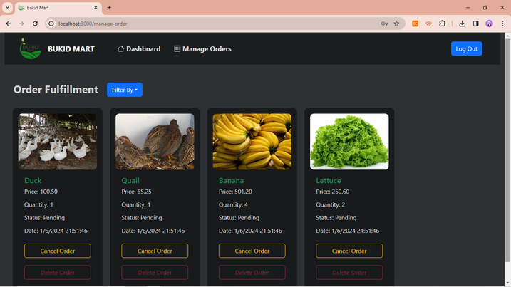

# Final Project

## Group Members:
1. FERRER, Danjes 
2. MERCADO, Karl 
3. PANGA, Eric Conrad
4. TANIG, Stephanie

## Section: EF-1L 

## 1. Project Description:
This project is an e-commerce website prototype developed by a team of four for the use of the Department of 
Agriculture (DA) to facilitate transactions between farmers and customers directly. The DA has the capability 
to compile a catalog of items for sale in the public market. The technology stack used was MERN: MongoDB for the 
database, Node JS based web server using Express JS for the backend, and React JS for the frontend.

## 2. Project Specifications:

### a. User Types and Accounts:
- There are two types of users / accounts: Administrators or Merchants, and Customers. 
- Customers register using their email address and password. There is no need for verification or OTP; they can 
simply register with a username using an email format.

- Upon signing up, customers are automatically assigned as customer users—individuals with the capability to make 
purchases from the shop.

- The Department of Agriculture (DA) has only one user account that manages the entire catalog of items available 
for distribution in the public market. They do not need to go through the registration process, as they already have 
their assigned accounts as merchants. In our project, the credentials of the sole administrator account are as follows:
admin@da.gov.ph (email address) and Administrator100! (password).
- The Department of Agriculture, as a built-in administrative user, also oversees the e-commerce management, which are 
as follows: management of accounts, order fulfillment, product listings, and sales reports.
- The general public cannot access the website unless they register in the system.

### b. E-commerce Management (Administrator / Merchant View)
- The Administrator view contains four pages: Dashboard, View Accounts, Manage Orders, and Manage Products. The Dashboard 
contains the Sales Report: a list of all products sold, total quantity of sales, and total sales income generated 
by each product. It also contains a Transaction Summary: a list of all transactions which can be sorted by weekly, monthly, 
and annual sales.

- Next, the View Accounts page oversees the list of all registered Customer accounts and reports its total.

- The Manage Orders page oversees the order fulfillment whereby after the Customer creates an order, the Merchant needs to 
confirm it. Once confirmed, the order is considered final and ready for delivery to the Customer. Orders can be filtered via 
the following statuses: All, Pending, Completed, and Cancelled.

- Lastly, the Manage Products page oversees the product listings. Products in the inventory can be sorted in ascending and 
descending order by the following categories: Title, Name, Type, Price, and Quantity. Moreover, the Merchant has the option 
to add a new product, as well as edit and delete products currently in the inventory.

### c. Shop (Customer View)
- The Customer View contains two pages: Dashboard and Manage Orders. The dashboard contains all products available in the shop. 
Product listings can be sorted in ascending and descending order by the following categories: None, Title, Type, Price, and Stock. 
The Customer can add items from the shop to the Cart, which reports the total quantity and total price of all items added in the 
Cart. In the Cart, the Customer has the option to delete individual items or remove them all at once. Once satisfied, the Customer 
has the option to checkout all items in the cart.

- Orders serve as confirmations for items purchased in the Cart. Similar to the Administrator view, the Manage Orders page also oversees 
the order fulfillment, whereby instead Customers have the option to cancel and subsequently delete the order if it has not yet been 
confirmed by the Merchant.  Moreover, the Customer has the option to filter orders via the following statuses: All, Pending, Completed,
and Cancelled.

### d. Additional Points
- We were able to implement data persistence for the Shopping Cart, whereby it is only rendered in the UI.

## 3. Schema:
The database structure used for this project (which is a modified version of the initial provided schema) is as
follows:
### a. User
- User ID (String: Mongoose Object ID)
- First Name (String)
- Middle Name (String)
- Last Name (String)
- User Type (String)
- Email (String)
- Password (String)
- Cart (Array of Mongoose Object ID)

### b. Product
- Product ID (String: Mongoose Object ID)
- Product Title (String)
- Product Name (String)
- Product Type (String: 1 - Crop / 2 - Poultry)
- Product Image URL (String)
- Product Price (Number)
- Product Quantity (Number)

### c. Order
- Order ID (String: Mongoose Object ID)
- Product ID (String: Mongoose Object ID, ID Reference to Product)
- Order Quantity (Number)
- Order Price (Number)
- Order Status (Number: 0 - Pending / 1 - Completed / 2 - Canceled)
- User ID (String: Mongoose Object ID, ID Reference to User)
- Date Ordered (Date)

## 4. Packages:
The packages installed for this project as well as their functions are as follows:
### a. Backend
- Bcrypt: encrypts and hashes passwords for secure storage
- Cookie Parser: parses HTTP request cookies for easy handling
- Cors: enables Cross-Origin Resource Sharing for secure communication between different domains
- Express: web application framework for building robust and scalable server-side applications
- JSON Web Token: implements secure token-based authentication and authorization
- Mongoose: ODM (Object Data Modeling) library for MongoDB and Node JS, simplifying database interactions
- Needle: lightweight HTTP client for making requests to external APIs
- Nodemon: monitors changes in the server-side code and automatically restarts the server during development

### b. Frontend
- React: JavaScript library for building interactive and dynamic user interfaces
- Bootstrap: frontend framework for designing responsive and visually appealing web applications
- Universal Cookie: enables cookie handling in both server-side and client-side environments for consistent 
state management

## 5. How to Run:
